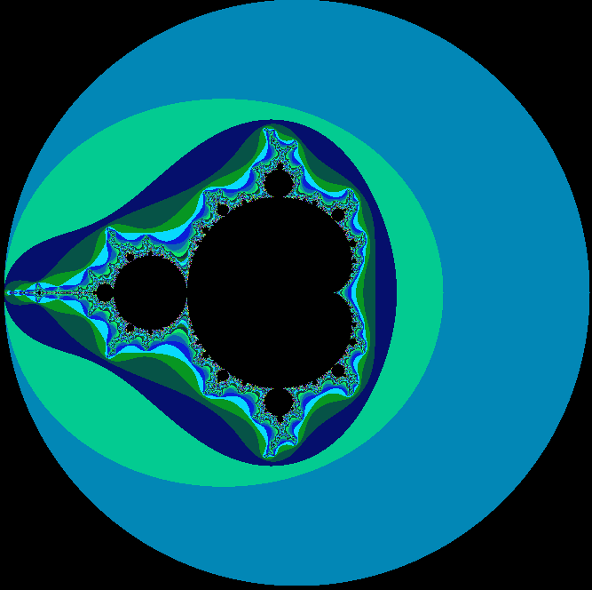
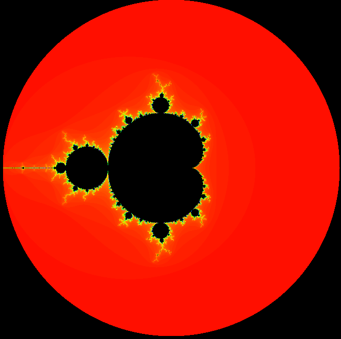

# Mandelbrot Visualiser
Website with interaction to visualise squared complex number with addition. 

Please have a look at the sourcecode at [GitHub](https://github.com/martinmolema/MandelBrotSquaredVisualiser) and an excellent explanation at [NumberPhile](https://www.youtube.com/watch?v=FFftmWSzgmk). 
I completely ripped this idea from their video, but the code is all original.

One of the underlying reasons to build this website was a function once implemented in the program
called ['Fractint'](https://en.wikipedia.org/wiki/Fractint) . This program had the capability to cycle the 
RGB-palette (256 colors then). This created some nice psychedelic effects which hardly any program nowadays
seems to have.

## Color cycling strategy
In version 5 I managed to get this color cycling back. Have a look at my videos to see this effect. It is done
by first calculating the number of iterations for each pixel. In the second stage the number of iterations
is converted to RGB-values that can be projected to the canvas.

To improve performance the colors are stored in a `ImageData`-array. This is an array containing 4 positions per 
pixel: one value for Red, Green, Blue and Alpha. Each position can store a value from 0-255 (being exactly one byte). 
Notice that an alpha value of 255 means full opacity (no alpha blending).

In the example below an array is created for a certain canvas. The function `createImageData` returns a compound
object containing the array. For convenience a variable `imageRGBValues` is created that points to this array. 
```javascript
    var canvas  = document.getElementById("mycanvas");
    var w = canvas.width;
    var h = canvas.height;
    var context = canvas.getContext('2d');
    var completeImage = context.createImageData(w, h);
    var imageRGBValues = completeImage.data;
 ```

Now that we have an array we can use our own array with one number (of iterations) per pixel to convert
this to the values in the `ImageData.data`. The array named `iterations` is a one dimensional array with the 
iteration-count per pixel. 

```javascript
for (var x=0;x<w;x++){
   for(var y=0;y<h;y++){
      var index = (y*w) + x;
      var iter = iterations[index];

      var color = createColorFromIterations(iter);       

      let array_index = (y * w * 4 + x * 4);

      imageRGBValues[array_index + 0] = color.RGB_R; // red
      imageRGBValues[array_index + 1] = color.RGB_G; // green
      imageRGBValues[array_index + 2] = color.RGB_B; // blue
      imageRGBValues[array_index + 3] = 255; // 255 = full opacity
   }    
}  
```

The function  `createColorFromIterations()` does the magic of converting the number of iterations to an object
containing values for Red, Green and Blue.

The simplest function to convert the number of iterations of a pixel to a color number could be to convert
the actual number of iterations to a ratio. Suppose the maximum number of iterations equals 200. For a certain
pixel (x,y) the number of iterations equals 93. The ratio would be 93 divided by 200 yields 0,465. The total number 
of colors in the RGB color palette is 16581375. So our iteration of 93 would yield an RGB-color of 7.710.339.

This needs to be split into its constituent RGB-values. This can be done using bit-shifting and bit-masks. The 
bit-representation would be:
```text 
0111 0101 1010 0110 1000 0011‬
|---R---| |---G---| |---B---|
```
By applying a mask for RED using the AND operation:
```text 
0111 0101 1010 0110 1000 0011‬ => 7.710.339 (dec)
1111 1111 0000 0000 0000 0000 => 16.711.680 (dec)
----------------------------- AND
0111 0101 0000 0000 0000 0000 => 368.640‬
```
This value is too high: an RGB value must be between 0 and 255. So we use bitshifting:

```text 
0111 0101 0000 0000 0000 0000 >> 16 ==> 0111 0101‬ ==> 117 (dec)
```
This bitshifting yields the decimal value 117. This is a valid range for the RED-component of the RGB.
The same goes for the Green and Blue components:
Blue (middle byte)
```text 
0111 0101 1010 0110 1000 0011‬ => 7.710.339 (dec)
0000 0000 1111 1111 0000 0000 => 65.280 (dec)
----------------------------- AND
0000 0000 1010 0110 0000 0000 >> 8 ==> 10100110 ==> 166
``` 

Right byte, no shifting needed!
```text 
0111 0101 1010 0110 1000 0011‬ => 7.710.339 (dec)
0000 0000 0000 0000 1111 1111 => 255 (dec)
----------------------------- AND
0000 0000 0000 0000 1000 0011 ==> 131
``` 

So when 93 iterations are input in the color function the result is (RGB) = (117, 166, 131).

Using javascript these filters 
```javascript
const MAX_ITERATIONS = 200;
const maxRangeRGB = 16581375; // 255 * 255 * 255, 3 bytes colorcode */

const RGB_FILTER_R = (255 << 16);  // left most byte  : 1111 1111 0000 0000 0000 0000
const RGB_FILTER_G = (255 << 8);   // middle byte     : 0000 0000 1111 1111 0000 0000
const RGB_FILTER_B = (255);        // right most byte : 0000 0000 0000 0000 1111 1111
```
 
Next the ratio we calculate can be applied to this maximum color number. The result is a position in the 
spectrum of the RGB-color palette. To break the long integer back to its three consituent colors we 
can use bitshifting combined with the AND-operation. In this example the maximum number of iterations is 200. 

```javascript
function createColorFromIterations(iterations){

    let ratio      = iterations / MAX_ITERATIONS;
    let ratedRatio = Math.ceil(ratio * maxRangeRGB); // integer needed!

    // use the &-operator for bit-wise AND operation
    // use >>-operator for shifting; the parameter is the number of bits that need to shift.
    let RGB_R = (ratedRatio & RGB_FILTER_R) >> 16;
    let RGB_G = (ratedRatio & RGB_FILTER_G) >> 8;
    let RGB_B = (ratedRatio & RGB_FILTER_B);

    // create an anonymous object (the object property-names are generated from the variable-names
    return {RGB_R, RGB_G, RGB_B};
}

```

Now the array will be completely filled with the right values. Now we can assign this ImageData-array to the canvas
which will ensure it is being drawn. See the references below 

```javascript
    // putImageData(imageData, dx, dy, dirtyX, dirtyY, dirtyWidth, dirtyHeight)
    context.putImageData(
        completeImage,  // array
        0, 0,
        0, 0,
        w, h
    );
 ```

Have a look at the class `FractalDrawer.js` and `MandelbrotAlternateFractalDrawer` for a complete implementation.
l wat 
A more advanced color palette can be created using the HSL/HSV (see references below). This requires some advanced
calculation using a circular palette. But because these colors change more fluently the effect is much better!

Compare the two images below. This first is drawn using the RGB palette and the next is drawn using the HSL-method. 





## The actual color cycling
Now that we now how to apply a palette to each pixel we can easily use this palette to rotate the colors by applying
a simple offset. By increasing this offset a sense of 'movement' can be achieved.

Looking at our RGB calculations we could apply this offset in the following manner, using an offset of 0% to 100%.
This percentage indicates how much we would like to offset the start of the palette. One could use an absolute
number, but when using different palettes this could become complicated. The RGB palette has 16.581.375 colors (255*255*255) 
whereas the HSL has a more complicated set using three different values (one of them being 360 degrees).

By using a Modulo function the palette cycles back to the beginning if the offset would create too high a value.

```javascript
    // simply use an index for the palette instead of calling a function each time.
    const realOffset = Math.ceil((this.offset / 100.0) * this.maxIterations);
    var paletteIndex = (realOffset + iter) % MAX_ITERATIONS;
    var color = palette[paletteIndex]
```

## Speed-up
In order to speed things up it is better to prepare the whole palette beforehand instead of making these 
CPU-intensive calculations per pixel. By calculating for each value of an iteration (0-200) the outcome of the 
palette the conversion from iteration to an RGB-color value can be simplified:

```javascript

function createPalette(){
    // create the array for the palette
    palette = new Array(MAX_ITERATIONS + 1);
    for (var j = 0;j <= MAX_ITERATIONS; j++) {
        palette[j]= createColorFromIterations(j);
    }
}
```

A working simpe example can be viewed [here](http://wiskunde.molema.org/example/). See the code in action on [Youtube](https://youtu.be/oQjXnukH60A).

## Links to working examples

Working examples published at my Homepage
  * [v1](http://wiskunde.molema.org/v1) / first simple version
  * [v2](http://wiskunde.molema.org/v2) / backdrop with actual Mandebrot fractal image + julia fractal
  * [v3](http://wiskunde.molema.org/v3) / zooming and zoom preview box
  * [v4](http://wiskunde.molema.org/v4) / live preview, new way of calculating
  * [v5](http://wiskunde.molema.org/v5) / yet another new way of calculating, live palette coloring and history 
  * [v6](http://wiskunde.molema.org/v7) / 
  * [v7](http://wiskunde.molema.org/v8) / RGB + HSL palette | proper history for zoom+palette | basic help-screen with the keyboard shortcuts.| resizable canvas | more shortcut keys (check out the dot and comma for color cycling) 
  * [v8](http://wiskunde.molema.org/v8) / Speed improvements/julia set preview
  * [v9](http://wiskunde.molema.org/v9) / Speed + code improvements; declutter GUI; large Julia Set. Export function 
  * [v10](http://wiskunde.molema.org/v10) / Removed Julia; added iterator lines; 
  * [v11](http://wiskunde.molema.org/v11) / Added loadable .map files from [XFractint](http://manpages.ubuntu.com/manpages/bionic/man1/xfractint.1.html)  containing palettes; improve colorcycling speed

## Video examples
Videos available at my [Youtube channel](https://www.youtube.com/playlist?list=PL-n4xRuGyhSGXnHdafaCmPnIzy8SXKyca). 

# Resources
  * [Fractint code](https://www.fractint.org/ftp/current/linux/)
  * [putImageData](https://developer.mozilla.org/nl/docs/Web/API/CanvasRenderingContext2D/putImageData)
  * [createImageData](https://developer.mozilla.org/en-US/docs/Web/API/CanvasRenderingContext2D/createImageData)
  * [HSL Calculator](https://www.w3schools.com/colors/colors_hsl.asp)
  
